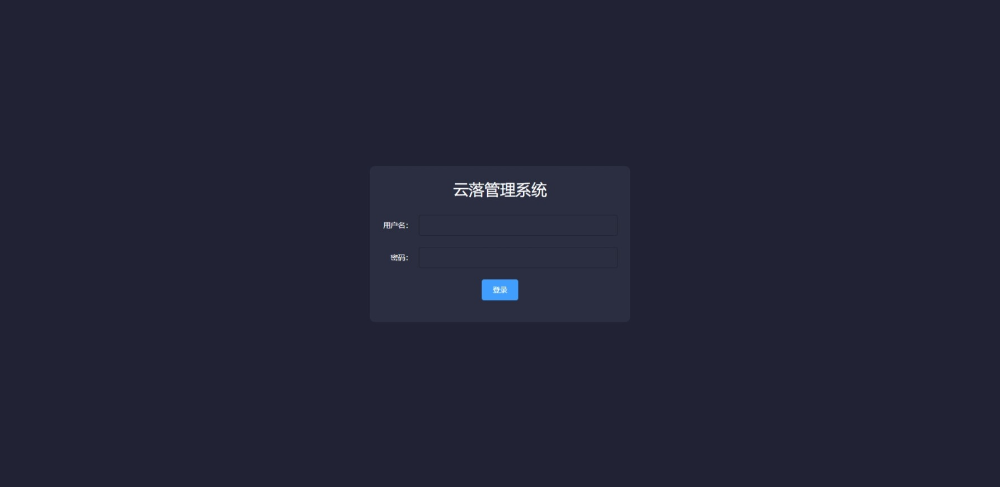
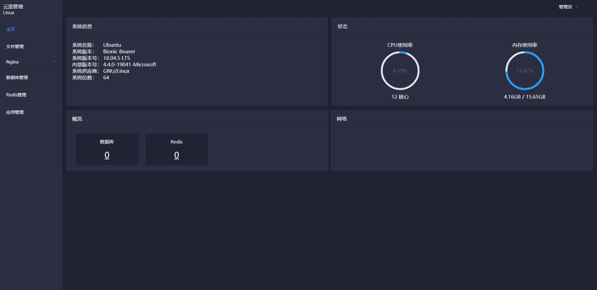
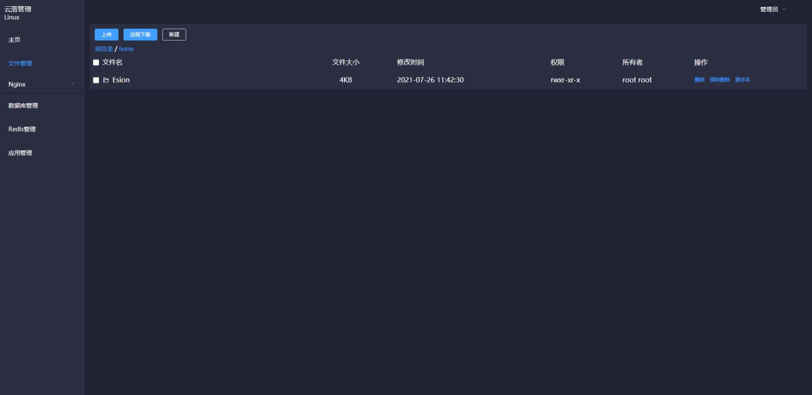
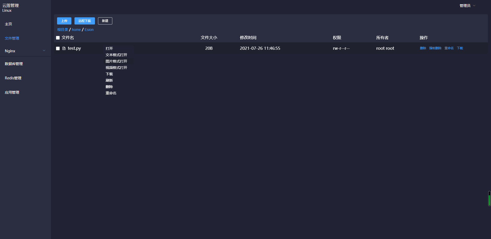

> 本项目部分功能基于Linux命令实现，请在linux系统下运行

基于springboot+vue，数据库存储为sqlite存储，只需要有java运行环境即可运行

# 参考

- [盘古](https://gitee.com/javashop/pangu)
- [BaoTa](https://gitee.com/terrydash/BaoTa)
- [phpMyAdmin](https://gitee.com/mirrors/phpMyAdmin)（[码云地址](https://gitee.com/mirrors/phpMyAdmin)）

# 安装

## 自行打包

```bash
git pull https://gitee.com/qiaoshengda/yun-luo-manage.git
cd yun-luo-manage
cd web
npm install
npm run build
cd ../java
mvn package -Dmaven.test.skip=true
cd target
java -jar manage-1.0.jar
```

访问地址：<localhost:7743>

## 下载安装

> 如果只是想体验功能，可以使用此方法

软件运行系统：Linux

软件运行基础：Java

下载发行版

使用`java -jar manage-1.0.0`运行

访问地址：<localhost:7743>

初始用户名：esion，初始密码：123456

# 功能



## 首页

各种信息的监控



## 文件管理（基本开发完成）

web文件浏览器（已完成大部分功能）





## 服务器管理

可以更加简单的管理安装在主机上的各种服务器

- 服务器列表（已完成）
- 服务器相关命令（基本开发完成）
- 服务器配置文件（基本开发完成）
- 服务器基础目录（未开始）

## 网站管理

- 开始

如果存在nginx：设置文件根目录，nginx文件。

如果不存在nginx，执行命令安装到设置目录。

- 使用

可视化配置nginx

## 数据库管理

mysql数据库可视化

- 左侧是数据库存放的数据库信息，包括数据库，表，字段
- 右侧上面是表数据信息，是通过双击左侧表进行查询，上面有`where`和`order by`
- 右侧下面是查询SQL的日志

## 监控

各种监控信息数据库存储

## 安全

操作日志

## 计划任务

1. 通过命令使用系统计划任务
2. java实现计划任务

## 系统管理

- 角色管理（已完成）
- 用户管理（已完成）


